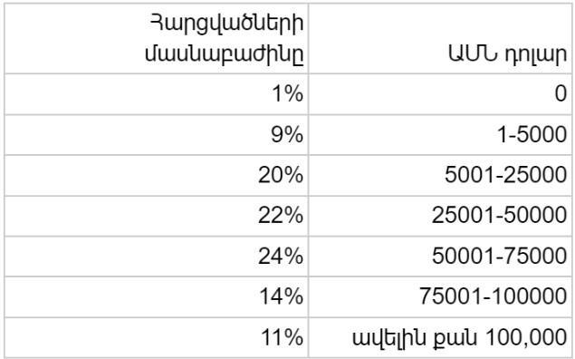
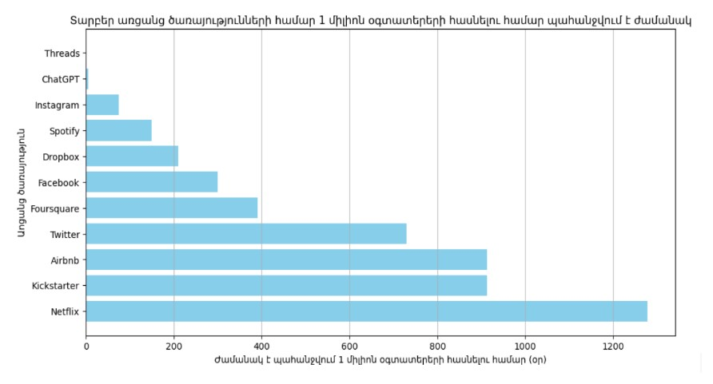
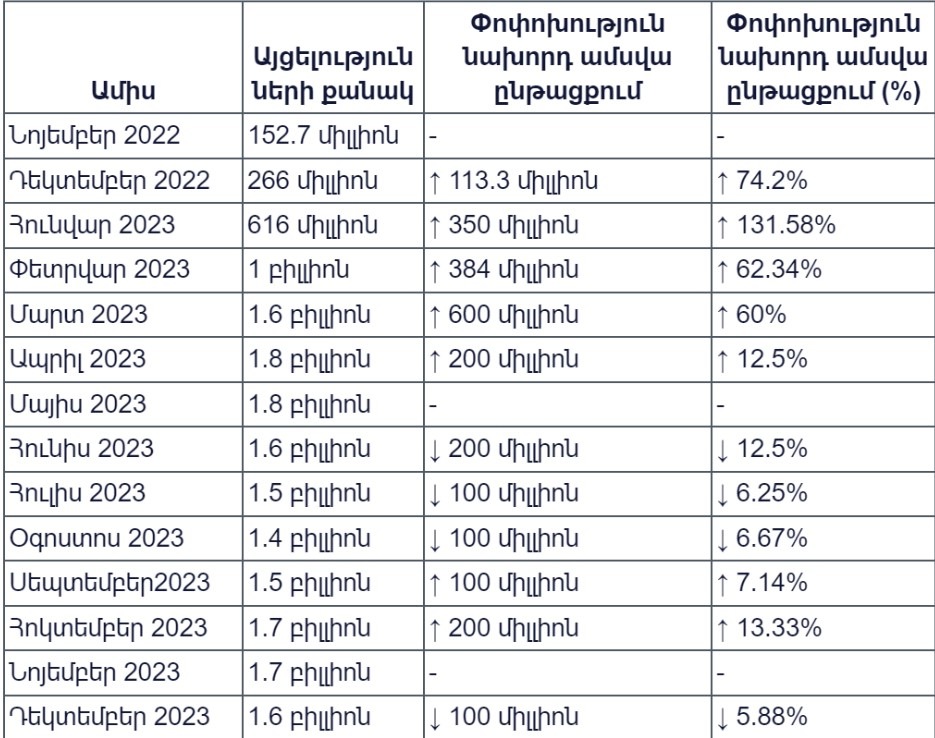
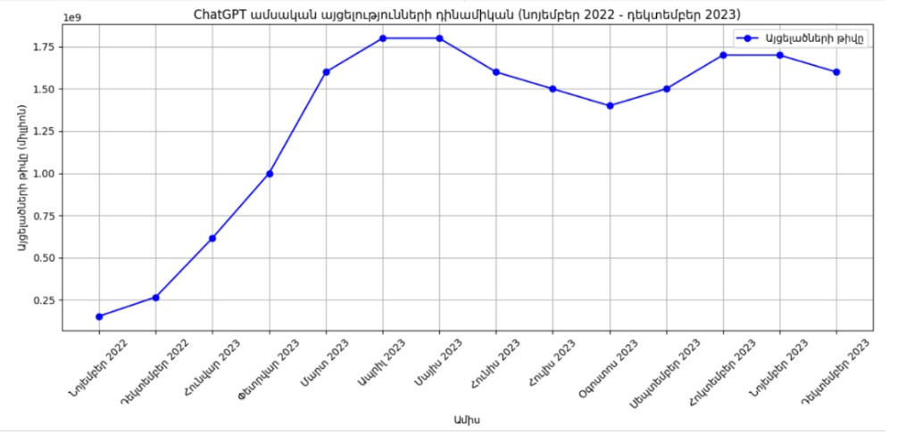
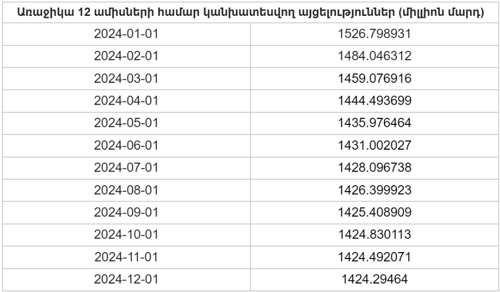
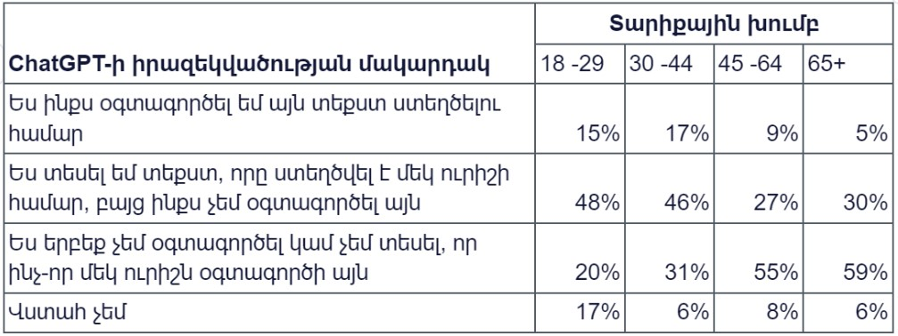
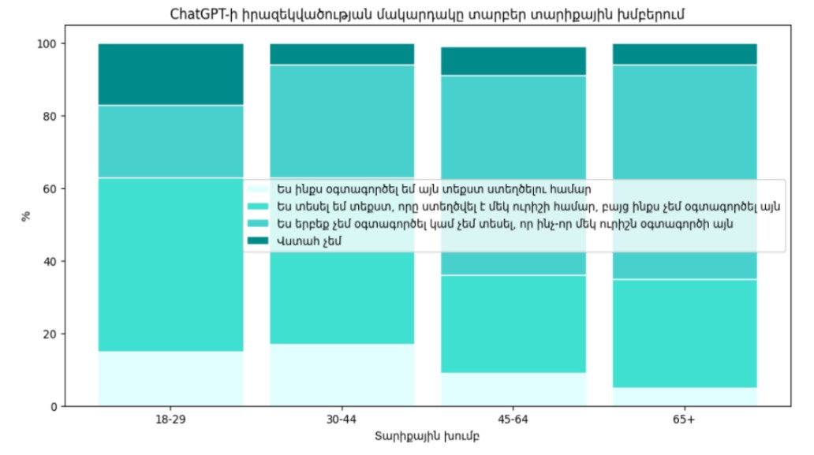

--- 

layout: post
title:  "ChatGPT-ի սոցիալական և տնտեսական ազդեցությունները"
image:  assets/images/3.jpg
author: Monica
---

**Գիտական հոդված** 
**Հեղինակ։ Մոնիկա Ավագյան**

**Հիմնաբառեր։**     ChatGPT, արհեստական բանականություն, գեներացված տեքստ, մեծ լեզվական մոդելներ 

**Ներածություն։** Ուշագրավ է, թե ինչպես է արհեստական բանականությունը կարողանում համոզիչ կերպով նմանակել մարդու վարքն ու գրելաոճը։ Արդյունքում դժվար է ասել՝ մա՞րդ, թե՞ մեքենա է գրել տեքստը։ 
Խորը ուսուցումը և բնական լեզվի մշակումը վերջերս հանգեցրել են  լեզվական մեծ մոդելների զարգացմանը: Այս նոր մոդելները կարող են սովորել մեծ քանակությամբ տվյալներից, ավելի լավ պատկերացնել լեզվի նրբերանգները՝ դրանք դարձնելով ավելի ճշգրիտ, քան երբևէ: Բացի այդ, այս մոդելներն այժմ կարող են կիրառվել այնպիսի խնդիրների լուծման համար, ինչպիսիք են տեքստի ամփոփումը, լեզուների թարգմանությունը և նույնիսկ բնօրինակ բովանդակություն ստեղծումը: 
ChatGPT-ը բնական լեզվի մշակման (NLP) մոդել է, որը մշակվել է 2022 թվականին OpenAI-ի կողմից: ChatGPT-ն կարող է ներդրվել և հզորացնել ու բարելավել  խոսակցական ԱԲ (արհեստական բանականություն) հավելվածները, ինչպիսիք են վիրտուալ օգնականները և չաթ-բոտերը: 
Այս աշխատանքի նպատակն է հասկանալ ChatGPT-ի օգտագործման ձևերը, օգտագործող ընկերությունների համար ծախսերի խնայողության առավելությունները՝ համեմատած այլ ծառայությունների, օգտատերերի իրազեկվածության մակարդակը և այլն։ Այդ իսկ պատճառով ուսումնասիրվել են ChatGPT-ի  մոդելի ներուժը և հնարավոր սոցիալական, տնտեսական դրական և բացասական ազդեցությունները, շրջակա միջավայրի վրա ազդեցությունը, կրթության ոլորտում աշխատանքի շուկայի ձևի փոփոխությունները, կատարվել է վերլուծություն, տվյալների հիման վրա ցուցադրվել է այցելությունների միտումները և կանխատեսվել ապագա այցելությունները։ Այս կանխատեսումները արժեքավոր են ChatGPT-ի ապագա աճի և ռազմավարական որոշումների կայացման առումով:
Այս աշխատանքում նաև դիտարկել ենք ChaGPT-ի ինտեգրման մասին կրթության մեջ, առօրյա կյանքում, ֆինանսական շուկաներում և այլ բնագավառներում:  
**Գրականության ակնարկ։**   Զրուցակից գտնելը երբեք ավելի հեշտ չի եղել քան 2022 թվականի վերջին ChatGPT-ի թողարկումից հետո: Մարդկային լեզվի իմաստաբանությունն ու նրբություններն ըմբռնելու ունակությունը այս համակարգին հնարավորություն են տալիս ճշգրիտ և խորաթափանց տեղեկատվություն տրամադրել՝ դարձնելով դա արժեքավոր գործիք այն օգտատերերի համար, ովքեր փնտրում են օգնություն, տեղեկատվություն կամ պարզապես բովանդակալից զրույցներ։
Ըստ OpenAI-ի, իրենց առաքելությունն է ապահովել, որ արհեստական ընդհանուր բանականությունից օգուտ քաղի ողջ մարդկությունը։ Նրանք մարզել են ChatGPT կոչվող մոդելը, որը  արհեստական բանականության վրա հիմնված չաթ-բոտ է և օգտագործում է GPT ալգորիթմը՝ հասկանալու և արձագանքելու մարդկային բանականությանը։ «Ես իսկապես տպավորված եմ։ Սա կօգնի մեզ՝ հետազոտողներիս, ավելի արդյունավետ լինել»,- ասում է Ֆիլադելֆիայի Փենսիլվանիայի համալսարանի աշխատակից Պիվիդորին։ 
«Հիմա ես ամեն օր օգտագործում եմ LLM»,- ասում է Իսլանդիայի համալսարանի համակարգչային գիտնական Հաֆշտեյն Էյնարսոնը: Նա սկսել է GPT-3-ից, բայց այժմ անցել է GPT-4-ին, որն օգնում է նրան պատրաստել պրեզենտացիաներ, ուսանողական քննություններ և դասընթացի առաջադրանքներ, ինչպես նաև ուսանողական թեզերը վերածել հոդվածների: Նրա խոսքով շատերն այն օգտագործում են որպես թվային քարտուղար-օգնական։ 
Ուոքեր-Սթոքելը պնդում է, որ ChatGPT-ն «game changer» է, որը կարող է դադարեցնել տարբեր ավանդական տնային առաջադրանքների կատարումը, ինչպիսիք են օրինակ էսսեներ գրելը:
ChatGPT-ն բացահայտ նվազեցնում է ուսանողի՝ առաջադրանքը կատարելու համար անհրաժեշտ գիտելիքները: Լավ ձևավորված հարցումները ուսուցման գործընթացն ավելի արդյունավետ են դարձնում՝ խրախուսելով քննադատական մտածողությունը և օգնելով համախմբել նոր տեղեկատվությունը։
Սակայն դեռևս բաց է մնում այն հարցը, թե ո՞վ է շահելու, իսկ ո՞վ է ետ մնալու։ Կա նաև լավատեսական տեսակետ, ըստ որի այն կդառնա հզոր գործիք շատ աշխատողների համար՝ բարելավելով նրանց կարողություններն ու փորձառությունը՝ միաժամանակ խթանելով ընդհանուր տնտեսությունը: Եթե իրականան այս սցենարը, տեխնոլոգիական գիտելիքներ ունեցող աշխատողներն ու ընկերությունները կարող են արագ տիրանալ ԱԲ գործիքներին՝ դառնալով այնքան արդյունավետ, որ գերիշխեն իրենց աշխատավայրերում և իրենց ոլորտներում: Նրանք, ովքեր ունեն ավելի քիչ հմտություններ և փոքր տեխնիկական ճարտարություն, պարզապես ետ կմնան: 
Սրան հակառակ, հոռետեսական տեսակետի հետևորդները նշում են, որ ընկերությունները պարզապես կօգտագործեն այն՝ ոչնչացնելու լավ վարձատրվող աշխատատեղերը, որոնք պահանջում են ստեղծագործական հմտություններ և տրամաբանական դատողություն. մի քանի բարձր տեխնոլոգիական ընկերություններ և տեխնոլոգիական էլիտաներ էլ ավելի կհարստանան, բայց դա աննշան կլինի ընդհանուր տնտեսական աճի ֆոնին: 
Բաց հասանելիությամբ գրախոսվող «PLOS թվային առողջություն» ամսագրի հեղինակները, ովքեր կենտրոնանում են թվային առողջապահական տեխնոլոգիաների վրա, ներառյալ դրանց մշակումը, ներդրումը և ազդեցությունը առողջության արդյունքների վրա, նշել են, որ «արդյունքները հուշում են, որ մեծ լեզվական մոդելները կարող են իրական ներուժ ունենալ բժշկական կրթության և, հնարավոր է, կլինիկական որոշումների կայացման հարցում»։
Finder.com-ի կողմից կատարած փորձը ցույց տվեց, որ ChatGPT-ն կարող է գերազանցել հանրաճանաչ ֆոնդերի կառավարիչներին՝ բաժնետոմսերն ընտրելով այնպիսի չափանիշների հիման վրա, ինչպիսիք են աճի պատմությունը և պարտքի մակարդակը, ինչը 38 բաժնետոմսերի հիպոթետիկ հաշվի մեջ հանգեցնում է 4,9% աճի՝ գերազանցելով 10 համեմատական ներդրումային ֆոնդերի միջին ցուցանիշը, կորուստ՝ 0,8%։ Եվ ընդհակառակը, Wall Street-ի ֆինանսական ֆոնդերի ղեկավարներն ու ներդրումային մենեջերները (ներառյալ նրանք, ովքեր տասնամյակներ շարունակ օգտագործել են մեքենայական ուսուցում) նշել են, որ ChatGPT-ն պարբերաբար թույլ է տալիս ակնհայտ սխալներ, որոնք ֆինանսապես թանկ հետևանքներ կունենան ներդրողների վրա, քանի որ նույնիսկ ԱԲ համակարգերը շուկայի միտումների կանխատեսման հարցում միայն սահմանափակ հաջողություն ունեցան՝ պայմանավորված  ֆինանսական շուկայական տվյալների  աղմկահարույց լինելով։
«Թյուրինգի թակարդը. մարդու նմանվող արհեստական բանականության խոստումը և վտանգը» գրքում Սթենֆորդի տնտեսագետ Էրիկ Բրինյոլֆսոնը գրում է որ մեկ տասնամյակի ընթացքում կանխատեսվում է, որ գեներատիվ ԱԲ-ն կարող է տրիլիոնավոր դոլարներ ավելացնել ԱՄՆ-ի տնտեսական աճին: 
Ինչպես գրում է Գարմյան համալսարանի նախագահության Տեղեկատվական տեխնոլոգիաների և վիճակագրության տնօրեն Մոհամմեդ Շակորը՝ ChatGPT-ն կարող է մեծ դեր խաղալ ծրագրավորման սխալների լուծման գործում՝ տրամադրելով սխալների ուղղում, սխալների կանխատեսում և սխալների բացատրություն: Սակայն, ինչպես ասվում է թեմատիկ հայտնի հոդվածներից մեկում՝ գիտելիքների կիրառման կարիք ունեցող խնդիրներին պատասխանելիս կարող են առաջանալ մարտահրավերներ: 
Բիլթոն Նիկի պնդմամբ մտահոգություն կա, որ ChatGPT-ն կարող է փոխարինել աշխատակիցներին, հատկապես այնպիսի բնագավառներում, ինչպիսիք են ստեղծագործություն գրելը, հաղորդակցությունը, լրագրությունը, կոդավորումը և տվյալների մուտքագրումը։ Քրիս Սթոքել-Ուոքերը և Ռիչարդ Վան Նորդենը պնդում են, որ LLM-ները նաև լայն մտահոգություն են առաջացրել՝ սկսած կեղծ տվյալներ գեներացնելուց մինչև վախեր այն մասին, որ մարդիկ արհեստական բանականության կողմից ստեղծված տեքստը ներկայացնում են որպես իրենց սեփականը: Երբ Nature-ը հետազոտողներին հարցրեցին ChatGPT-ի նման չաթ-բոտերի հնարավոր օգտագործման մասին հատկապես գիտության մեջ, նրանց ոգևորությունը փոխարինվեց վախով: «Եթե հավատում եք, որ այս տեխնոլոգիան վերափոխման ներուժ ունի, ապա կարծում եմ՝ պետք է մտահոգվեք դրա մասին»,- ասում է Գրինին:
Հետազոտողների խոսքով շատ բան կախված կլինի նրանից, թե ինչպես ապագա կարգավորումներն ու ուղեցույցները կարող են սահմանափակել արհեստական բանականությամբ չաթ-բոտերի օգտագործումը: Բացի այդ Associated Press-ը գրում է, որ առաջատար տեխնոլոգիական ընկերությունները՝ Microsoft-ը, OpenAI-ը և Google-ը, ընդունել են, որ արհեստական բանականության իրենց գործիքների աճող պահանջարկը հսկայական ծախսեր է պարունակում՝ թանկարժեք կիսահաղորդիչներից մինչև ջրի սպառման ավելացում: 
Այն նաև հսկայական էլեկտրաէներգիա է պահանջում ու շատ ջերմություն է առաջացնում: 2022 թվականին Microsoft ընկերությունը 6.4 միլիարդ լիտր ջուր է սպառել տվյալների կենտրոնների սառեցման համար, որոնք անհրաժեշտ են իրենց ամպային ծառայությունները գործարկելու համար, ինչպիսին է Azure-ը։ Սա համարժեք է միջին չափի 640 միլիոն դույլ ջրի կամ օլիմպիական 2560 լողավազանի տարողության։ Պատճառն այն է, որ ChatGPT-ի նման արհեստական բանականության մոդելներ ստեղծելու համար շատ ջուր է անհրաժեշտ։ 
Արհեստական բանականության աշխատանքում ջրի նման ծավալների օգտագործումը հետևյալ կերպ է բացատրվում․ «Պատկերացրեք, որ դուք ունեք գերարագ, գերխելացի և շատ զբաղված ուղեղ. ահա թե ինչպիսին է արհեստական բանականությամբ աշխատող համակարգիչը: Երբ մենք մարզվում ենք կամ շատ ենք մտածում, մեր մարմնի ջերմաստիճանը բարձրանում է, նույն կերպ համակարգչային ուղեղն է աշխատելիս տաքանում: Իսկ համակարգիչները չեն սիրում շատ տաքանալ․ նրանք կարող են խափանվել կամ սկսել դանդաղ աշխատել: Այսպիսով, մեզ անհրաժեշտ է միջոց՝ դրանք զովացնելու համար: Մենք գիտակցում ենք, որ մեծ մոդելների ուսուցումը կարող է էներգատար և ջրատար գործընթաց լինել», - բացատրում է OpenAI-ը։                  
**Մեթոդաբանություն։** Հետազոտության ընթացքում կատարվել է ChatGPT-ի սոցիալական ազդեցության հետ կապված տարբեր տվյալների հավաքածուների համապարփակ վերլուծություն՝ հասկանալու տվյալների բաշխումն ու բնութագրերը, այնուհետև, օգտագործվել է ռեգրեսիոն վերլուծություն՝ փոփոխականների միջև հարաբերությունները ուսումնասիրելու համար: 
Մեթոդաբանությունը ներառում է տվյալների հավաքագրում բազմաթիվ աղբյուրներից, այդ թվում՝ ընկերության հաշվետվություններից, օգտատերերի հարցումներից և առցանց օգտագործման վիճակագրությունից։ Տվյալների հավաքածուները ներառում են ChatGPT օգտագործող ԱՄՆ ընկերությունների կողմից խնայված գումարի չափը, ChatGPT-ի օգտատերերի տարածաշրջանային բաշխվածության, տարբեր տարիքային խմբերի իրազեկվածության մակարդակը, ամսական այցելությունների միտումները և 1 միլիոն օգտատերերի հասնելու համար պահանջվող ժամանակի մասին տեղեկատվություն՝ համեմատած այլ առցանց ծառայությունների հետ։
Իրականացվել է վիճակագրական վերլուծություն․ կիրառվել են մի քանի վիճակագրական տեխնիկաներ, նկարագրողական վիճակագրություն, լոգիստիկ ռեգրեսիա տարիքային խմբի և իրազեկվածության մակարդակի միջև կապը մոդելավորելու համար: ժամանակային շարքի ռեգրեսիայի ARIMA(1,1,1) մոդելը օգտագործելով ՝ կանխատեսվել է այցելությունները հաջորդ 12 ամիսների համար:
Տվյալները պատկերավոր ներկայացնելու համար կիրառվել են վիզուալիզացիայի տարբեր տեխնիկաներ։ 
**Վերլուծություն։**  Արհեստական բանականության այս չաթ-բոտը շատ կարճ ժամանակում միլիոնավոր օգտատերերի գրավեց։ Ըստ հարապարակված տվյալների, OpenAI-ի լսարանը կազմում է 65,13% տղամարդ և 34,87% կին: Այցելուների ամենամեծ տարիքային խումբը 25-34 տարեկաններն են (գրեթե 35%):
Վենչուրային կապիտալիստները և այլ ներդրողներ միլիարդներ են ծախսում  ընկերությունների վրա, որոնք հիմնված են գեներատիվ ԱԲ-ի վրա, և հավելվածների և ծառայությունների ցանկը, որոնք առաջնորդվում են լեզվական մեծ մոդելներով, օրեցօր ավելանում է: Օրինակ Microsoft-ը 10 միլիարդ դոլար է ներդրել OpenAI-ում՝ ձեռք բերելով ընկերության բաժնետոմսերի 46%-ը: OpenAI-ն ակնկալում է, որ մինչև 2024 թվականի վերջ իր եկամուտը կավելանա մինչև 1 միլիարդ դոլար: 
ChatGPT օգտագործող ընկերությունների  կողմից խնայված գումարի չափը ներկայացնող տվյալների հիման վրա կատարենք նկարագրողական վիճակագրական վերլուծություն՝ հասկանալու համար խնայողությունների բաշխումը: 

Աղյուսակ 1․ ChatGPT օգտագործող ընկերությունների  կողմից խնայված գումարի չափը  
  

Միջին խնայողություններ: 62725.445 
Մեդիանա: 62500.5 
Խնայողությունների շրջանակը: 197499.5 
Խնայողությունների միջքառորդական միջակայք (IQR): 50000.0 
Ըստ ստացված չափանիշների, ChatGPT օգտագործող ընկերությունների միջին խնայողությունները կազմում են $62,725,445, որի համեմատ տարբեր ծառայություններ օգտագործող այլ ընկերությունների միջին խնայողությունները կազմում են $50,000: ChatGPT օգտագործող ընկերություններն ունեն ավելի բարձր միջին խնայողություն՝ մոտավորապես $12,725,445՝ համեմատած այլ ծառայություններ օգտագործող ընկերությունների:  ChatGPT օգտագործող ընկերությունների խնայողությունների շրջանակը $197,499.5 է: Այլ ընկերությունների խնայողությունների շրջանակը կազմում է $150,000, որն  ավելի բարձր է $47,499.5-ով, այլ ծառայություններից օգտվող ընկերությունների համեմատ: ChatGPT օգտագործող ընկերությունների խնայողությունների միջքառորդական միջակայքը (IQR) կազմում է $50,000, այլ ընկերությունների համար՝ $30,000, որը բարձր է $20,000-ով՝ համեմատած այլ ծառայություններից օգտվող ընկերությունների հետ (Աղյուսակ 1): 
Այս համեմատությունները ցույց են տալիս, որ ChatGPT օգտագործող ընկերությունները միջինում ունեն խնայողությունների ավելի լայն շրջանակ՝ համեմատած այլ ծառայություններ օգտագործող ընկերությունների հետ: Սա ցույց է տալիս, որ ChatGPT-ն կարող է ավելի արդյունավետ լինել՝ օգնելու ընկերություններին գումար խնայել: 

Գծապատկեր 1․ Տարբեր առցանց ծառայությունների համար 1 միլիոն օգտատերերի հասնելու համար պահանջվող ժամանակ  
  
Ըստ OpenAI-ի գործադիր տնօրեն Սեմ Ալթմանի թվիթերի հրապարակման, ChatGPT-ն իր գործարկման առաջին հինգ օրվա ընթացքում հավաքել է մեկ միլիոն օգտատեր: Գործարկումից ընդամենը երկու ամսվա ընթացքում ChatGPT-ի ամսական ակտիվ օգտատերերը հատեցին 100 միլիոնը՝ դարձնելով այն պատմության մեջ ամենաարագ աճող սպառողական հավելվածը (Գծապատկեր 1)։

Աղյուսակ 2․ ChatGPT նկարագրող այլ ցուցանիշներ  
  

Վերոնշյալ տվյալների հիման վրա բացահայտենք ChatGPT-ի ամսական այցելությունների միտումները և կանխատեսենք ապագա այցելությունները՝ օգտագործելով վիճակագրական վերլուծության մեթոդը: Տվյալների հավաքածուն ներառում է ամսական այցելությունների տվյալներ 2022 թվականի նոյեմբերից մինչև 2023 թվականի դեկտեմբեր ամիսները (Աղյուսակ 2): Նկարագրողական վիճակագրությունը ցույց է տալիս այս ժամանակահատվածում այցելությունների աճի միտումը՝ 2023 թվականի ապրիլին և մայիսին այցելությունների գագաթնակետին կազմելով 1,8 միլիարդ: Ժամանակային շարքի գծապատկերը ցույց է տալիս ընդհանուր վերընթաց հետագծով միտում՝ բայց տատանումներով (Գծապատկեր 2). 
  
Գծապատկեր 2․ChatGPT ամսական այցելությունների դինամիկան(նոյեմբեր   2022-դեկտեմբեր 2023) 
Այժմ, իրականացնենք ժամանակային շարքի ռեգրեսիա՝ օգտագործելով ARIMA(1,1,1)  մոդելը՝ հաջորդ 12 ամիսների այցելությունները կանխատեսելու համար: 

 Աղյուսակ 3․ Առաջիկա 12 ամիսների համար կանխատեսվող այցելություններ   

 

Մոդելը կանխատեսում է այցելությունների մի փոքր անկում՝ 2024 թվականի հունվարին 1526,8 միլիոնից մինչև 2024 թվականի դեկտեմբեր՝ 1424,3 միլիոնի          (Աղյուսակ 3): 
Այնուամենայնիվ, հետազոտությունները ցույց են տալիս, որ ChatGPT-ի օգտատերերի թիվը  կշարունակի աճել, թեև որոշ տատանումներով: Այս կանխատեսումները արժեքավոր պատկերացումներ են տալիս ChatGPT-ի ապագա աճի համար և կարող են կարևոր լինել ռազմավարական որոշումների կայացման մեջ: 

 Աղյուսակ 4․ ChatGPT-ի իրազեկվածության մակարդակ 

 

Աղյուսակ 4-ը  ներկայացնում է մարդկանց տեղեկացվածությունը ChatGPT-ի մասին։  Օգտագործել ենք լոգիստիկ ռեգրեսիա տարիքային խմբի և իրազեկվածության մակարդակի հարաբերությունները մոդելավորելու համար, որը վերադարձնում է գործակիցներ իրազեկվածության մակարդակի (կախյալ փոփոխականի) և տարիքային խմբի յուրաքանչյուր  կատեգորիայի համար (անկախ փոփոխականների): Գործարկվել է առավելագույն հավանականության գնահատման (MLE) մեթոդը․ 
  
Գծապատկեր 3․ChatGPT-ի իրազեկվածության մակարդակը տարբեր տարիքային խմբերում 

Գործակիցները ցույց են տալիս յուրաքանչյուր տարիքային խմբի տեղեկացվածության մակարդակի լոգարիթմական հավանականությունը՝ համեմատած տեղեկատու խմբի հետ: Իրազեկվածության ամենաբարձր մակարդակը 30-ից 44 տարիքային խմբում է (18%), 48%-ը տեսել է տեքստ, որը ստեղծվել է ուրիշի կողմից, բայց ինքը չի օգտագործել այն, 18-ից 29 տարեկանների խումբն ունի մարդկանց ամենաբարձր տոկոսը (15%), ովքեր օգտագործել են ChatGPT տեքստ ստեղծելու համար, 45-ից 64 և 65+ տարիքային խմբերն ունեն ChatGPT-ի  անձնական օգտագործման ամենացածր մակարդակը և չեն  տեսել որևէ մեկին ChatGPT-ից օգտվելուց: Բոլոր տարիքային խմբերում կա մի զգալի տոկոս (17%-ից 31%), ովքեր վստահ չեն ChatGPT-ի մասին իրենց տեղեկացվածության մեջ (Գծապատկեր 3):  
**Եզրակացություն։** ChatGPT՝ արհեստական բանականության վրա հիմնված չաթ-բոտը, որը մշակվել է OpenAI-ի կողմից, ցույց է տվել ուշագրավ ներուժ տարբեր ոլորտներում՝ ներառյալ կրթությունը, ֆինանսները, առողջապահությունը և ծրագրավորումը: Սոցիալական ազդեցության վերլուծությունը բացահայտում է հետաքրքիր միտումներ և պատկերացումներ դրա ընդունման, օգտագործողների և ապագա հնարավոր աճի վերաբերյալ: Արհեստական բանականության չաթ-բոտը կարճ ժամանակահատվածում հավաքել է միլիոնավոր օգտատերերի՝ հիմնականում տղամարդկանց լսարանով և զգալի մասով՝ 25-34 տարիքային խմբում: Այս համատարած ընդունումը արտացոլվում է Microsoft-ի նման ընկերությունների զգալի ներդրումներով, ինչը մատնանշում է ԱԲ-ի վրա հիմնված ծառայությունների նկատմամբ բարձր վստահությունը: 
Հետազոտության մեջ ուսումնասիրվել է ChatGPT օգտագործող ընկերությունների ծախսերի խնայողության առավելությունները՝ ցույց տալով, որ այս ընկերությունները միջին հաշվով զգալիորեն ավելի շատ են խնայում այլ ծառայություններից օգտվող կազմակերպությունների համեմատ: Այս բացահայտումն ընդգծում է ChatGPT-ի օգտագործման արդյունքում ստացված ֆինանսական առավելությունները: Ավելին, ամսական այցելությունների միտումների վերլուծությունը բացահայտում է ChatGPT-ի արագ աճի հետագիծը, որի օգտատերերի տրաֆիկը հասնում է 1,8 միլիարդի: Թեև մոդելը կանխատեսում է այցելությունների մի փոքր անկում առաջիկա ամիսների համար, ընդհանուր միտումը ենթադրում է շարունակական աճ՝ ChatGPT-ն դարձնելով ամենաարագ աճող սպառողական հավելվածներից մեկը: 
Ուսումնասիրելով օգտատերերի իրազեկվածությունը տարբեր տարիքային խմբերում՝ պատկերավոր ներկայացվել է ChatGPT-ի հետ ծանոթության տարբեր մակարդակները: 30-44 տարիքային խումբը ցույց է տալիս ամենաբարձր տեղեկացվածությունը: Ի հակադրություն, 65+ տարիքային խումբն ունի իրազեկվածության և օգտագործման ամենացածր մակարդակը:
Ընդհանուր առմամբ, վերլուծությունը ընդգծում է ChatGPT-ի փոխակերպման ներուժը ոլորտներում և նրա դերը ԱԲ-ի վրա հիմնված ծառայությունների ապագայի ձևավորման գործում: Քանի որ ChatGPT-ը շարունակում է զարգանալ և կատարելագործվել, դրա ազդեցությունը հասարակության, բիզնեսի և անհատների վրա շարունակելու է աճել՝ դարձնելով այն ազդեցիկ ԱԲ-ի բնագավառում:
Եզրափակելով, թեև ChatGPT-ն առաջարկում է խոստումնալից առավելություններ, դրա համատարած ընդունմանը պետք է զգույշ մոտենալ՝ հաշվի առնելով էթիկական նկատառումները, կանոնակարգերը և շրջակա միջավայրի վրա ազդեցությունները:

  
**Օգտագործված գրականություն**  
Kung TH, Cheatham M, Medenilla A, Silos C, De Leon L, Elepaño C, Madriaga M, Aggabao R, Diaz-Candido G, Maningo J, Tseng V. Performance of ChatGPT on USMLE: Potential for AI-assisted medical education using large language models. PLOS Digit Health. 2023 Feb 9;2(2):e0000198. doi: 10.1371/journal.pdig.0000198. PMID: 36812645; PMCID: PMC9931230   
Stokel-Walker C, Van Noorden R. What ChatGPT and generative AI mean for science. Nature. 2023 Feb;614(7947):214-216. doi: 10.1038/d41586-023-00340-6. PMID: 36747115.
3,Hutson M. Could AI help you to write your next paper? Nature. 2022 Nov;611(7934):192-193. doi: 10.1038/d41586-022-03479-w. PMID: 36316468.   
Hutson M. Could AI help you to write your next paper? Nature. 2022 Nov;611(7934):192-193. doi: 10.1038/d41586-022-03479-w. PMID: 36316468.   
David Mhlanga, 'Open AI in Education, the Responsible and Ethical Use of ChatGPT Towards Lifelong Learning'' SSRN: 13 Feb 2023, 1-19   
Alkaissi H, McFarlane SI. Artificial Hallucinations in ChatGPT: Implications in Scientific Writing. Cureus. 2023 Feb 19;15(2):e35179. doi: 10.7759/cureus.35179. PMID: 36811129; PMCID: PMC9939079.   
Kung TH, Cheatham M, Medenilla A, Silos C, De Leon L, Elepaño C, Madriaga M, Aggabao R, Diaz-Candido G, Maningo J, Tseng V. Performance of ChatGPT on USMLE: Potential for AI-assisted medical education using large language models. PLOS Digit Health. 2023 Feb 9;2(2):e0000198. doi: 10.1371/journal.pdig.0000198. PMID: 36812645; PMCID: PMC9931230.   
Anna Cooban, ''ChatGPT can pick stocks better than your fund manager''  CNN: 2023    
Gregory Zuckerman "AI can write a song, but it can't beat the market",The wall street journal; 2023   
Erik Brynjolfsson; The Turing Trap: The Promise & Peril of Human-Like Artificial Intelligence. Daedalus 2022; 151 (2): 272–287. doi: https://doi.org/10.1162/daed_a_01915   
Nigar M. Shafiq Surameery, & Mohammed Y. Shakor. (2023). Use Chat GPT to Solve Programming Bugs. International Journal of Information Technology &Amp; Computer Engineering (IJITC) ISSN : 2455-5290, 3(01), 17–22. https://doi.org/10.55529/ijitc.31.17.22   
Malinka, Kamil, et al. "On the educational impact of chatgpt: Is artificial intelligence ready to obtain a university degree?." Proceedings of the 2023 Conference on Innovation and Technology in Computer Science Education V. 1. 2023.   
Nick Bilton, ''ChatGPT Made Me Question What It Means to Be a Creative Human''  Vanity Fair: DECEMBER 9, 2022 https://www.vanityfair.com/news/2022/12/chatgpt-question-creative-human-robotos   
Chris Stokel-Walker & Richard Van Noorden, ‘’What ChatGPT and generative AI mean for science 
Researchers are excited but apprehensive about the latest advances in artificial intelligence.’’ Nature: 06 February 2023   https://www.nature.com/articles/d41586-023-00340-6   
Matt O’Brien & Hannah Fingerhut,  ''Artificial intelligence technology behind ChatGPT was built in Iowa — with a lot of water'' Ap news:September 10, 2023 https://apnews.com/article/chatgpt-gpt4-iowa-ai-water-consumption-microsoft-f551fde98083d17a7e8d904f8be822c4?utm_source=copy&utm_medium=share   
Նարե Պետրոսյան, «Արհեստական բանականությունը ավելացրել է ջրի սպառումը տեխնոլոգիական ընկերություններում» , 13 Սպտ 2023  https://hetq.am/hy/article/159991
https://explodingtopics.com/blog/chatgpt-users     
Նարե Պետրոսյան, «Արհեստական բանականությունը ավելացրել է ջրի սպառումը տեխնոլոգիական ընկերություններում» , 13 Սպտ 2023  https://hetq.am/hy/article/159991
https://explodingtopics.com/blog/chatgpt-users    

